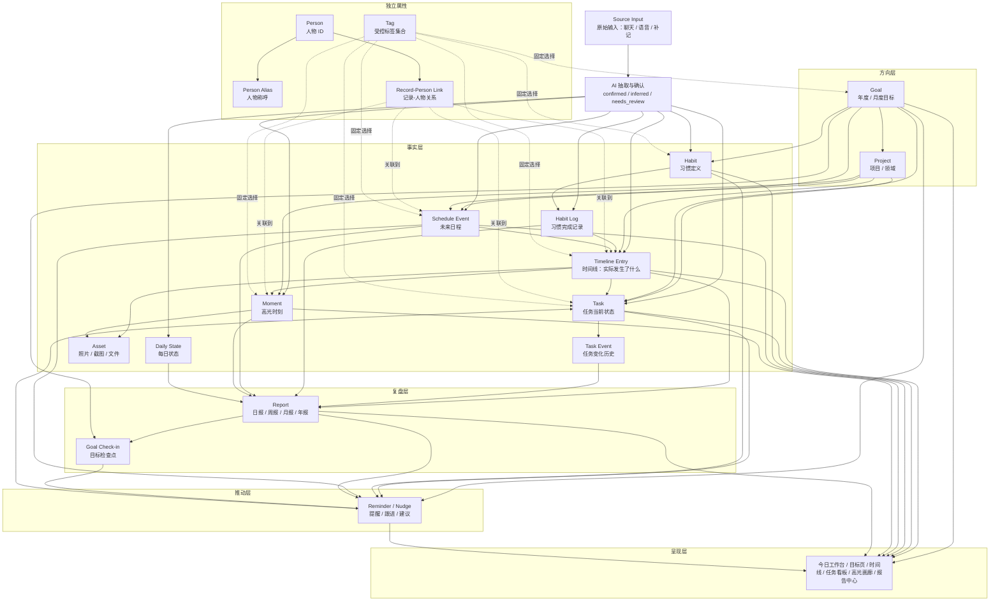

# 个人数字化系统 Schema 设计

## 1. 目标

这个系统的目标不是做一个普通待办工具，而是把你每天和 AI 的聊天、行动、任务、照片、状态和复盘沉淀成一个可查询、可统计、可回放的个人数字化档案。

核心问题有四个：

1. 今天我实际把时间花在哪里？
2. 哪些任务、项目、关系、状态长期影响我？
3. 哪些时刻值得保留，而不是淹没在流水账里？
4. 日报、周报、月报、年报能否基于事实自动生成，而不是靠回忆重写？

## 2. 设计原则

### 2.1 事实优先

系统里最重要的是事实记录，而不是 AI 总结。日报、周报、月报、年报只是对事实的二次解释，可以重算、可以覆盖、可以废弃。

事实包括：

- 原始输入：你对 AI 说了什么。
- 时间线：几点到几点在做什么。
- 任务状态：任务创建、推进、完成、放弃、删除。
- 高光时刻：值得保留的事件、照片、故事。
- 状态记录：每天或某段时间的整体质量，以及必要的自由文本说明。
- 习惯记录：想长期坚持什么，以及每天/每周是否完成。
- 日程事件：未来某天某个时间要做的事，以及后续是否真的发生。

### 2.2 原始输入必须保留

AI 抽取出来的结构化记录可能有误，所以每条结构化记录都要能追溯到原始输入。

例如你说：

> 下午 2 点到 4 点和唐博讨论 AlayaBox，感觉这个方向越来越清楚了，可以算今天的高光。

系统应该至少产生三类记录：

- 一条原始输入。
- 一条 timeline。
- 一条 moment。

这三条记录之间应该有关联，后续如果 AI 抽错了，可以回到原文校正。

### 2.3 Timeline 是主干

Timeline 是这个系统的主干。任务、项目、标签、高光时刻、报告都应该尽量和 timeline 关联。

原因是：时间是最稳定的个人事实维度。任务会改名，项目会重组，标签会调整，但“某天某个时间段发生了什么”通常不会变。

### 2.4 任务状态要保留历史

任务不只需要当前状态，还需要状态变化历史。

例如：

- 创建任务。
- 开始处理。
- 阻塞。
- 重新推进。
- 完成。
- 放弃。

这些状态变化本身也是个人行为数据，后续可以分析哪些任务容易拖延、哪些项目经常被中断、哪些任务最终被放弃。

### 2.5 高光时刻独立于流水账

高光时刻不应该只是 timeline 的一个标签。

Timeline 记录“发生了什么”，moment 记录“为什么值得保存”。同一个 timeline 可以关联一个 moment，但 moment 应该有自己的标题、故事、重要性、附件和展示方式。

### 2.6 报告只引用事实，不制造事实

日报、周报、月报、年报可以有观点、总结、建议，但报告中的统计必须来自事实表。

报告应该记录它引用了哪些 timeline、task、moment、state，而不是直接变成新的事实来源。

### 2.7 目标负责方向，任务负责动作

年度目标、月度目标不应该和任务混在一起。

目标回答：

- 我这一年 / 这一月想把什么变好？
- 成功标准是什么？
- 当前进展是否偏离？

任务回答：

- 下一步具体做什么？
- 谁来做？
- 什么时候做完？
- 当前状态是什么？

同一个目标可以关联多个项目和任务；一个任务也可以服务于某个目标。但目标不是大号任务，任务也不是小号目标。

### 2.8 AI 提醒必须有依据

AI 不应该凭空提醒“你该努力了”。每一次提醒都应该能解释来源：

- 因为某个任务到期。
- 因为某个目标本月没有推进。
- 因为某个项目长时间没有 timeline 记录。
- 因为某个日程即将开始。
- 因为某个习惯连续几天没有记录。
- 因为日报/周报里出现了阻塞。
- 因为你之前明确要求过 follow-up。

提醒本身也要有状态：待提醒、已提醒、已完成、已忽略、已推迟。否则 AI 提醒会变成新的噪音源。

### 2.9 关联字段默认可选

系统应该先允许记录事实，再逐步补全关联。

很多信息一开始并不一定知道：

- 一个高光时刻可能暂时没有项目。
- 一段 timeline 可能没有任务。
- 一张照片可能只知道发生日期，不知道对应项目。
- 一条提醒可能只来自报告观察，不一定能落到具体任务。

所以 `project_id`、`task_id`、`timeline_id`、`goal_id` 这类关联字段，除非有明确业务约束，默认都应该可为空。缺少关联不代表记录无效，只代表以后可以补齐。

### 2.10 标签是受控集合，人物是独立属性

Tag 不应该被 AI 当成自由文本随意生成。它应该是一组稳定、受控的系统集合，用来表达活动类型、工作模式、状态信号、价值判断、兴趣爱好等横向维度。

人物不能混进 tag。和谁见面、谁参与讨论、谁影响某件事，应该通过独立的 person_id 关联，而不是生成“唐博”“朋友”“客户”这类标签。

这个边界很重要：

- Tag 负责分类。
- Project 负责长期方向。
- Task 负责行动。
- Person 负责人物关联。

如果 AI 识别到一个新人物，可以进入待确认；如果 AI 识别到一个新标签，应该先映射到已有集合。无法映射但确实代表新的稳定活动或分类时，进入“标签候选”，经确认后才能加入 tag 集合。

### 2.11 习惯和日程是轻量执行辅助

习惯和日程不应该替代 timeline。

习惯回答：

- 我想长期坚持什么？
- 今天或本周有没有完成？
- 这个习惯服务于哪个目标或生活方向？

日程回答：

- 未来某天某个时间我要做什么？
- 地点、备注、关联目标或标签是什么？
- 到时间后是否需要提醒、完成、取消或转成 timeline？

Timeline 仍然记录“实际发生了什么”。日程是计划，习惯是重复承诺，Reminder 是提醒机制。三者可以互相引用，但不要混成同一张记录。

## 3. v1 核心实体

v1 不追求一次性覆盖所有可能性，只保留长期稳定、不可替代的核心实体。

### 3.1 Source Input：原始输入

记录你每次告诉 AI 的原话。它是所有结构化记录的证据来源。

典型来源：

- 聊天输入。
- 语音转文字。
- 手动补记。
- 自动导入。

典型表达：

- “我开始做 xxx。”
- “我先写一会儿 xxx。”
- “xxx 做完了。”
- “接下来切到 xxx。”
- “做 xxx，休息一下。”
- “10 点到 12 点在做 xxx。”

关键字段：

| 字段 | 含义 |
| --- | --- |
| input_id | 原始输入 ID |
| happened_at | 这句话描述的时间，或输入发生的时间 |
| channel | 输入渠道，例如 chat、voice、manual、import |
| raw_text | 原始文本 |
| author | 输入者，一般是 user |
| metadata | 可选扩展信息，例如设备、地点、语音文件路径 |

设计说明：

- 原始输入不应该被覆盖，只能追加更正记录。
- AI 抽取的 timeline、task、moment 都应该能反向找到对应 input。
- 同一句话可以抽取出多条结构化记录。

### 3.2 Timeline Entry：时间线记录

记录某个时间段或某个时间点发生了什么。

Timeline 是系统最核心的事实表，但它不应该主要靠手动填表产生。它应该主要由 Source Input 推导出来：你用自然语言告诉 AI 当前在做什么、做完了什么、切换到什么、要休息一下，系统再把这些输入整理成时间段。

记录类型：

| 类型 | 含义 |
| --- | --- |
| activity_block | 明确的活动块，例如 10:00-12:00 写方案 |
| state_event | 状态事件，例如突然很累、心情很好 |
| gap | 时间空档，例如 15:00-16:00 没记清、刷手机 |
| note | 临时备注，不一定有完整时间段 |

关键字段：

| 字段 | 含义 |
| --- | --- |
| timeline_id | 时间线记录 ID |
| start_at | 开始时间 |
| end_at | 结束时间，可为空 |
| local_date | 本地日期，用于日报统计 |
| timezone | 时区 |
| title | 简短标题 |
| description | 详细描述 |
| kind | activity_block、state_event、gap、note |
| project_id | 关联项目，可为空 |
| task_id | 关联任务，可为空 |
| quality | 这段时间的主观质量，1-5，可为空 |
| is_estimated | 是否为补记或估算 |

设计说明：

- `start_at` 和 `end_at` 支持真正的时间段，这样后续能做 timeline 展示和时间统计。
- `end_at` 可以为空，表示这是一条正在进行中的 timeline；后续“做完了”“切到别的事”“休息一下”等输入会关闭它。
- 不确定的时间也可以记录，但要标记 `is_estimated`。
- 不要强迫每条 timeline 都挂任务。有些生活、社交、休息、状态事件本来就不是任务。
- 涉及多个人时，通过 Record-Person Link 关联，不在 timeline 里直接保存多人列表。
- 不要在每条 timeline 里拆 energy、mood、focus 等多个评分；默认最多只保留一个 `quality`。

### 3.2.1 Timeline 推导规则

Timeline 的输入不是固定表单，而是聊天里的行动表达。

| 用户表达 | 系统动作 |
| --- | --- |
| “我开始做 xxx” | 创建一条正在进行的 timeline，`start_at` 为当前输入时间，`end_at` 为空 |
| “我先写一会儿 xxx” | 创建一条正在进行的 timeline，标题为 xxx |
| “xxx 做完了” | 关闭匹配的正在进行 timeline，把 `end_at` 设为当前输入时间 |
| “接下来切到 xxx” | 关闭当前正在进行 timeline，并创建新的 xxx timeline |
| “做 xxx，休息一下” | 关闭或记录 xxx 的 timeline，再创建休息类 timeline |
| “10 点到 12 点在做 xxx” | 创建一条已完成的历史 timeline，开始和结束时间来自原文 |
| “刚才在做 xxx” | 创建估算 timeline，标记 `is_estimated` |

设计说明：

- Source Input 是原始证据，Timeline Entry 是推导结果。
- 每次推导都要保留从哪条 Source Input 来。
- 如果当前已经有一条未结束 timeline，新输入表示切换或休息时，默认先关闭上一条。
- “休息一下”“吃饭”“路上”“睡觉”等不应该被当成 gap，它们是明确活动；只有不知道发生了什么时才用 gap。
- 如果用户只是说“做完 xxx”，但系统找不到对应的进行中 timeline，可以创建一条 `note` 或进入待确认，不要凭空补时长。

### 3.3 Task：任务

记录你要做、正在做、已完成或放弃的事项。

任务状态：

| 状态 | 含义 |
| --- | --- |
| todo | 待做 |
| doing | 进行中 |
| blocked | 阻塞 |
| done | 完成 |
| abandoned | 放弃 |
| deleted | 删除 |

关键字段：

| 字段 | 含义 |
| --- | --- |
| task_id | 任务内部 ID |
| task_code | 人类可读任务编号，例如 T-20260527-001 |
| title | 任务标题 |
| description | 任务说明 |
| status | 当前状态 |
| priority | 优先级，1-5 |
| goal_id | 关联目标，可为空 |
| project_id | 关联项目 |
| parent_task_id | 父任务，可为空 |
| due_at | 截止时间 |
| created_at | 创建时间 |
| status_updated_at | 最近状态更新时间 |
| completed_at | 完成时间 |
| outcome | 结果说明 |

设计说明：

- `task_code` 给人看，`task_id` 给系统用。
- “删除”不建议物理删除，应该变成 `deleted` 状态，避免报告和历史统计断裂。
- 放弃和删除要区分：放弃是主动判断不做，删除更像录错、重复或不再需要追踪。
- 任务可以直接关联目标；实际投入通过 timeline 的 `task_id` 反向证明。
- 任务涉及负责人、协作者、评审者时，通过 Record-Person Link 关联，并用 `relation_role` 区分角色。

### 3.4 Task Event：任务事件

记录任务状态和重要信息的变化历史。

关键字段：

| 字段 | 含义 |
| --- | --- |
| event_id | 任务事件 ID |
| task_id | 对应任务 |
| event_type | created、status_changed、renamed、rescheduled、note |
| from_status | 原状态 |
| to_status | 新状态 |
| happened_at | 发生时间 |
| note | 说明 |
| input_id | 来源原始输入 |

设计说明：

- Task 表保存当前状态，Task Event 保存历史。
- 后续做周报时，可以统计“本周新增任务、完成任务、放弃任务、阻塞任务”。

### 3.5 Project：项目 / 领域

任务是短期动作，项目和领域承载长期方向。

项目可以是明确项目：

- AlayaBox。
- Admissions。
- 论文投稿。

也可以是长期领域：

- 健康。
- 家庭。
- 学习。
- 关系维护。

关键字段：

| 字段 | 含义 |
| --- | --- |
| project_id | 项目 ID |
| name | 项目名 |
| type | project 或 area |
| status | active、paused、done、archived |
| parent_project_id | 父项目 |
| started_on | 开始日期 |
| ended_on | 结束日期 |
| description | 说明 |

设计说明：

- 不要把所有事情都强行变成任务，有些东西应该归到长期领域。
- project 和 area 可以先用一个实体承载，用 `type` 区分，避免一开始实体过多。

### 3.6 Tag：受控标签

标签用于横向分类，适合表达项目/任务/人物之外的维度。Tag 是受控集合，不是 AI 自由生成的关键词。

建议标签按“类别 + 父子层级”组织。类别只负责把一级标签分组；更细的标签应该挂在父标签下面，只有用户选中父标签时才展开。

| 类别 | 示例 | 用途 |
| --- | --- | --- |
| activity_type | work、study、meeting、rest、hobby | 记录活动类型 |
| work_mode | deep_work、admin | 记录工作模式，可作为 work 的子标签 |
| value_signal | high_value、maintenance、low_value | 记录价值判断 |
| state_signal | interrupted、blocked、low_quality、high_quality | 记录状态信号 |
| life_area | health、family、relationship、personal_growth | 记录生活领域 |

层级示例：

| 父标签 | 子标签 |
| --- | --- |
| work 工作 | writing 写作、deep_work 深度工作、admin 事务 |
| hobby 爱好 | music 玩音乐、dance 跳舞、golf 高尔夫 |

关键字段：

| 字段 | 含义 |
| --- | --- |
| tag_id | 标签 ID |
| tag_key | 稳定机器名，例如 deep_work |
| name | 标签名 |
| category | 标签类别 |
| parent_tag_key | 父标签，可为空 |
| description | 标签说明 |
| color | 展示颜色 |
| sort_order | 展示顺序 |
| is_active | 是否启用 |

设计说明：

- 标签应该少而稳定，不要每句话都生成新标签。
- AI 默认只能从已有标签集合里选择，不能静默创建新标签。
- 无法匹配的标签进入候选区，由用户定期决定是否加入标签集合。
- 新增 tag 的合理场景是出现新的稳定活动或分类，例如以前没有 `golf`，某天你去打高尔夫，就可以确认新增 `activity_type:hobby > golf`。
- 标签可以挂在 timeline、task、moment、report 上。
- 玩音乐、跳舞、高尔夫这类爱好是活动类型下的子标签，不需要单独作为一类顶层类别；只有当它变成长期方向时，才需要同时建 Project/Area。
- 人名、组织名、地点名不要放进 tag。

### 3.7 Person：人物

记录系统里被稳定引用的人。Person 是轻量身份目录，不是复杂人脉 CRM。

关键字段：

| 字段 | 含义 |
| --- | --- |
| person_id | 人物 ID |
| display_name | 展示名 |
| role | 角色说明，例如导师、同事、朋友、客户 |
| organization | 所属组织，可为空 |
| relationship_type | 关系类型 |
| note | 备注 |
| is_active | 是否仍然活跃 |

设计说明：

- timeline、task、moment、report 可以通过 person_id 关联人物。
- person_id 是独立 attribute，不通过 tag 表达。
- 一个人的多个称呼不直接塞进一个 alias 字段，而是用 Person Alias 管理。
- AI 识别到新人物时，不应直接创建长期人物档案，应该先进入待确认。
- “和唐博讨论 AlayaBox”应当表现为：timeline 关联 project_id=AlayaBox，同时关联 person_id=唐博。

### 3.8 Person Alias：人物称呼

记录同一个人的多个称呼、昵称、简称和可能的转写。

例如：

```text
person_id = person_you_zhengxin
display_name = 游正新

aliases:
  - 游正新
  - 游老师
  - 正新
```

关键字段：

| 字段 | 含义 |
| --- | --- |
| alias_id | 称呼 ID |
| person_id | 对应人物 ID |
| alias_text | 称呼文本，例如 游老师 |
| alias_type | real_name、nickname、title、short_name、transcription |
| is_primary | 是否主展示名 |
| confidence | 这个称呼归属该人物的置信度 |
| source_input_id | 这个称呼从哪条原始输入确认，可为空 |

设计说明：

- 一个 person 可以有多个 alias。
- 一个 alias 默认只能指向一个 person；如果“张老师”可能指多人，要进入待确认。
- 展示时优先使用 Person 的 `display_name`，匹配时可以用所有 alias。
- 用户说“游老师”时，系统应该解析到同一个 `person_id=person_you_zhengxin`。

### 3.9 Record-Person Link：记录与人物关联

记录一件事涉及哪些人，以及每个人在这件事里的角色。

它解决两个问题：

1. 一件事可以涉及多个朋友。
2. 同一个人在不同事情里扮演的角色不同。

关键字段：

| 字段 | 含义 |
| --- | --- |
| record_id | 被关联的记录，例如 timeline、task、moment、report |
| person_id | 关联人物 ID |
| relation_role | 在这条记录里的角色 |
| mention_text | 原文里出现的称呼 |
| confidence | AI 匹配置信度 |
| note | 补充说明 |

常见 `relation_role`：

| 角色 | 含义 |
| --- | --- |
| participant | 参与者 |
| owner | 负责人 |
| collaborator | 协作者 |
| mentioned | 被提到的人 |
| requester | 提需求的人 |
| reviewer | 评审者 |
| audience | 面向对象 |

示例：

> 晚上和游老师、A、B 一起吃饭，聊了个人数字化系统。

应表达为：

| record | person | relation_role | mention_text |
| --- | --- | --- | --- |
| 这条 timeline | 游正新 | participant | 游老师 |
| 这条 timeline | A | participant | A |
| 这条 timeline | B | participant | B |

设计说明：

- 不要在 timeline 里只放一个 `person_id` 字段，也不要用逗号字符串保存多人。
- 多人物关系应该是独立关联，因为每个人都有自己的角色、原文称呼和置信度。
- 如果 AI 只知道“几个朋友”，但不知道具体是谁，可以先不关联 person，或者进入待确认。

### 3.10 Moment：高光时刻

记录值得长期保存的时刻。

Moment 可以来自 timeline，也可以独立创建。

关键字段：

| 字段 | 含义 |
| --- | --- |
| moment_id | 高光时刻 ID |
| happened_at | 发生时间 |
| local_date | 本地日期 |
| title | 标题 |
| story | 这个时刻为什么重要 |
| importance | 重要性，1-5 |
| project_id | 关联项目，可为空 |
| task_id | 关联任务，可为空 |
| timeline_id | 关联 timeline，可为空 |

设计说明：

- moment 强调“值得留下来的意义”，不是单纯记录事件。
- 高光时刻可以独立存在；没有关联项目、任务或 timeline 时也应该允许记录。
- 照片、截图、文档不直接塞进 moment，而是通过 Asset 关联。
- 关联人物通过 Record-Person Link 表达，不直接塞 `person_ids`。

### 3.11 Asset：素材 / 附件

记录照片、视频、音频、文档、截图等文件。

关键字段：

| 字段 | 含义 |
| --- | --- |
| asset_id | 素材 ID |
| file_path | 本地文件路径 |
| media_type | image、video、audio、document、other |
| mime_type | 文件类型 |
| captured_at | 拍摄或创建时间 |
| original_filename | 原始文件名 |
| checksum | 文件校验值，用于去重 |
| metadata | EXIF、尺寸、来源等扩展信息 |

设计说明：

- 数据库只保存文件路径和元信息，不直接保存大文件。
- 一个 asset 可以关联多个 moment、timeline 或 task。
- 高光照片建议按年份/月/记录 ID 存文件，数据库只保存索引。

### 3.12 Daily State：每日状态

记录一天的整体状态，用于和 timeline、任务效率、报告做关联。

关键字段：

| 字段 | 含义 |
| --- | --- |
| state_id | 每日状态 ID |
| local_date | 日期 |
| sleep_hours | 睡眠时长 |
| quality | 当天整体质量，1-5，可为空 |
| one_line | 一句话总结 |
| reflection | 当天反思 |

设计说明：

- 每天最多一条 Daily State。
- 它不替代 timeline，只记录当天整体状态。
- 不要每天问一堆状态评分；v1 默认只保留一个 `quality`，其他状态放在 `one_line` 或 `reflection` 里。
- 以后可以回答“什么样的日子更容易产出高质量结果”。

### 3.13 Report：报告

记录 AI 生成的日报、周报、月报、年报。

报告类型：

| 类型 | 含义 |
| --- | --- |
| day | 日报 |
| week | 周报 |
| month | 月报 |
| quarter | 季报 |
| year | 年报 |
| custom | 自定义周期报告 |

关键字段：

| 字段 | 含义 |
| --- | --- |
| report_id | 报告 ID |
| period_type | day、week、month、year 等 |
| period_start | 周期开始 |
| period_end | 周期结束 |
| title | 报告标题 |
| summary | 报告正文 |
| metrics | 统计指标 |
| generated_at | 生成时间 |
| status | draft、final、superseded |
| model | 生成模型 |
| prompt_version | 提示词版本 |

设计说明：

- 报告应该保存正文，也应该保存统计指标。
- 如果报告重新生成，旧版本不要直接覆盖，可以标记为 superseded。
- 报告需要记录它引用了哪些事实记录。

### 3.14 Habit：习惯

记录你想长期坚持的行为定义。

关键字段：

| 字段 | 含义 |
| --- | --- |
| habit_id | 习惯 ID |
| title | 习惯标题 |
| cadence | daily、weekly、custom |
| target_count | 每个周期目标次数 |
| status | active、paused、archived |
| priority | 优先级，1-5 |
| note | 怎么算完成，可为空 |
| goal_id | 关联目标，可为空 |
| created_at | 创建时间 |

设计说明：

- Habit 保存“我想坚持什么”，不保存每天是否完成。
- Habit 可以有 tag，例如 健康、写作、高尔夫、高价值。
- Habit 可以关联目标，但不强制。比如“每天记录一句 timeline”可以只是系统使用习惯。

### 3.15 Habit Log：习惯记录

记录某个习惯在某天或某个周期内是否完成。

关键字段：

| 字段 | 含义 |
| --- | --- |
| habit_id | 对应习惯 |
| local_date | 记录日期 |
| status | done、skipped、missed |
| quality | 这次完成质量，1-5，可为空 |
| note | 简短备注，可为空 |
| timeline_id | 关联实际发生的 timeline，可为空 |
| logged_at | 记录时间 |

设计说明：

- Habit Log 是事实记录，应该能进入日报、周报统计。
- 如果一次习惯本身占用了明确时间，例如“跳舞 1 小时”，可以同时关联 timeline。
- 不要把 habit log 做成复杂打卡系统；v1 只需要完成/跳过/漏掉和一个可选质量分。

### 3.16 Schedule Event：日程事件

记录未来某天某个时间计划要做的事。

关键字段：

| 字段 | 含义 |
| --- | --- |
| event_id | 日程 ID |
| title | 日程标题 |
| start_at | 开始时间 |
| end_at | 结束时间，可为空 |
| status | planned、done、cancelled、missed |
| location | 地点，可为空 |
| note | 备注，可为空 |
| goal_id | 关联目标，可为空 |
| project_id | 关联项目，可为空 |
| task_id | 关联任务，可为空 |
| timeline_id | 真实发生后的 timeline，可为空 |

设计说明：

- Schedule Event 是计划，不是事实。真正发生后，最好生成或关联 timeline。
- 日程可以有 tag，例如 高价值、沟通、高尔夫、休息。
- Reminder 可以提醒某个日程快到了，但日程本身不等于提醒。

### 3.17 Goal：目标

记录年度目标、季度目标、月度目标，也可以支持自定义周期目标。

目标层级：

| 层级 | 含义 |
| --- | --- |
| year | 年度目标 |
| quarter | 季度目标 |
| month | 月度目标 |
| week | 周目标，可选 |
| custom | 自定义周期目标 |

关键字段：

| 字段 | 含义 |
| --- | --- |
| goal_id | 目标 ID |
| title | 目标标题 |
| level | year、quarter、month、week、custom |
| period_start | 目标周期开始 |
| period_end | 目标周期结束 |
| parent_goal_id | 父目标，例如月度目标归属年度目标 |
| project_id | 主要关联项目，可为空 |
| status | active、paused、done、missed、abandoned |
| priority | 优先级，1-5 |
| why | 为什么这个目标重要 |
| success_criteria | 成功标准 |
| target_value | 目标值，可选 |
| current_value | 当前值，可选 |
| unit | 指标单位，例如 小时、篇、次、元 |
| review_cadence | 复盘频率，例如 daily、weekly、monthly |

设计说明：

- 目标可以有指标，也可以是定性目标。
- 年度目标可以拆到月度目标，月度目标再落到项目和任务。
- 不要把所有任务、习惯、日程都强行挂目标；只有对方向有贡献的记录才需要挂。

### 3.18 Goal Check-in：目标检查点

记录某个目标在某个时间点的进展、偏差、阻塞和下一步。

关键字段：

| 字段 | 含义 |
| --- | --- |
| checkin_id | 检查点 ID |
| goal_id | 对应目标 |
| checked_at | 检查时间 |
| period_start | 检查覆盖周期开始 |
| period_end | 检查覆盖周期结束 |
| progress_summary | 进展摘要 |
| progress_value | 当前进展数值，可选 |
| confidence | AI 或用户对进展判断的置信度 |
| blockers | 主要阻塞 |
| next_action | 建议下一步 |
| report_id | 来源报告，可为空 |
| input_id | 来源原始输入，可为空 |

设计说明：

- Goal 保存目标当前状态，Goal Check-in 保存过程轨迹。
- 月报、周报可以自动生成 Goal Check-in。
- AI 判断“目标偏离”时，应该引用最近的 Check-in 和实际 timeline/task 数据。

### 3.19 Reminder / Nudge：提醒与推动

记录 AI 应该在什么时候、因为什么、提醒你做什么。

提醒类型：

| 类型 | 含义 |
| --- | --- |
| schedule | 固定时间提醒 |
| due | 截止时间提醒 |
| follow_up | 跟进提醒 |
| stale_task | 长时间未推进任务 |
| goal_drift | 目标偏离提醒 |
| review | 日报、周报、月报等复盘提醒 |
| suggestion | AI 根据上下文给出的建议 |

关键字段：

| 字段 | 含义 |
| --- | --- |
| reminder_id | 提醒 ID |
| title | 提醒标题 |
| reminder_type | 提醒类型 |
| trigger_type | time、event、condition、ai |
| trigger_at | 触发时间，可为空 |
| recurrence | 重复规则，可为空 |
| status | pending、fired、done、ignored、snoozed、cancelled |
| priority | 优先级，1-5 |
| reason | 为什么提醒 |
| suggested_action | 建议动作 |
| goal_id | 关联目标，可为空 |
| project_id | 关联项目，可为空 |
| task_id | 关联任务，可为空 |
| last_fired_at | 最近提醒时间 |
| snoozed_until | 推迟到什么时候 |

设计说明：

- Reminder 不等于 Task。提醒可以推动你看一个目标、复盘一周、处理一个阻塞，不一定本身就是任务。
- Reminder 不等于 Schedule Event。日程保存“未来要做什么”，提醒只负责在合适时间推你一把。
- AI 主动提醒必须写明 reason，否则用户很难信任。
- 被忽略、推迟、完成都要记录，这会让 AI 学会什么提醒有用、什么提醒是噪音。

## 4. 核心关系

### 4.1 一图看懂



读图方式：

1. 你说的话先进入 Source Input，再由 AI 抽取成结构化事实。
2. Timeline 是事实主干，Task 是行动状态，Habit 是重复承诺，Schedule Event 是未来计划，Moment 是长期记忆。
3. Goal 和 Project 在上层决定方向，不能替代真实执行记录。
4. Tag 是受控集合，只做分类；Person 用 Alias 解决多称呼，用 Record-Person Link 解决多人物和角色。
5. Report 和 Goal Check-in 负责复盘，Reminder / Nudge 根据事实、目标、习惯和日程把下一步推回日常。

### 4.2 关系总览

```text
Source Input
  -> Timeline Entry
  -> Task / Task Event
  -> Habit / Habit Log
  -> Schedule Event
  -> Moment
  -> Daily State

Person
  -> Person Alias
  -> Record-Person Link
  -> Timeline Entry
  -> Task
  -> Schedule Event
  -> Moment
  -> Report

Project
  -> Goal
  -> Task
  -> Timeline Entry
  -> Schedule Event
  -> Moment

Goal
  -> Goal Check-in
  -> Project
  -> Task
  -> Habit
  -> Schedule Event
  -> Reminder / Nudge

Task
  -> Task Event
  -> Timeline Entry
  -> Moment
  -> Reminder / Nudge

Habit
  -> Habit Log
  -> Timeline Entry
  -> Reminder / Nudge

Schedule Event
  -> Timeline Entry
  -> Reminder / Nudge

Timeline Entry
  -> Moment
  -> Asset

Moment
  -> Asset

Report
  -> Goal Check-in
  -> Timeline Entry
  -> Task
  -> Task Event
  -> Habit Log
  -> Schedule Event
  -> Moment
  -> Daily State
```

### 4.3 多对多关系

以下关系建议用关联表表达：

| 关系 | 说明 |
| --- | --- |
| Record - Source Input | 一条结构化记录可以来自多个原始输入 |
| Record - Tag | goal、timeline、task、habit、schedule event、moment 都可以有多个标签 |
| Person - Person Alias | 一个人可以有多个称呼，一个称呼默认指向一个人物 |
| Record - Person | timeline、task、schedule event、moment、report 可以关联多个人物，并记录每个人在该记录里的角色 |
| Record - Asset | 一张照片可以关联多个记录 |
| Report - Record | 报告引用多个事实记录 |
| Goal - Project | 一个目标可以由多个项目支撑，一个项目也可以服务多个目标 |
| Goal - Task | 一个目标可以拆成多个任务，一个任务也可能服务某个目标 |
| Task - Timeline | 一个任务可以被多个实际发生的 timeline 推进；timeline 的 `task_id` 可以为空 |
| Goal - Habit | 一个目标可以被多个习惯支撑，一个习惯也可能服务某个目标 |
| Schedule Event - Timeline | 一个计划日程发生后，可以关联到实际 timeline |
| Habit Log - Timeline | 一次习惯完成如果占用明确时间，可以关联到实际 timeline |
| Reminder - Record | 一个提醒可以由目标、任务、项目、报告、timeline、habit 或 schedule event 触发 |

这里的 Record 可以理解成一个抽象概念，不一定需要在 v1 做成实体表。实现时也可以分别设计 timeline_tags、task_tags、moment_assets 等关联关系。

## 5. 典型写入流程

### 5.1 从聊天推导 timeline

Timeline 的默认写入方式是聊天推导，而不是让用户填表。

场景一：开始做一件事。

用户输入：

> 我开始写个人数字化系统的 schema。

系统写入：

1. Source Input：保存原话。
2. Timeline Entry：创建一条正在进行的时间线，标题为“写个人数字化系统 schema”，`start_at` 为当前输入时间，`end_at` 为空。
3. Tag：从受控标签集合里选择，例如 deep_work、writing、high_value。
4. 如果存在对应任务，则关联 task_id。

场景二：做完一件事。

用户输入：

> schema 写完了。

系统写入：

1. Source Input：保存原话。
2. Timeline Entry：找到正在进行的“写个人数字化系统 schema”，把 `end_at` 设为当前输入时间。
3. 如果关联了任务，可以同步写入 Task Event，例如 status_changed 或 note。

场景三：切换或休息。

用户输入：

> schema 先写到这里，休息一下。

系统写入：

1. Source Input：保存原话。
2. Timeline Entry：关闭当前“写 schema”的时间线。
3. Timeline Entry：创建新的“休息”时间线，`start_at` 为当前输入时间，`end_at` 为空。

场景四：补记一段已经完成的时间。

用户输入：

> 10 点到 12 点在写个人数字化系统的 schema，主要是在想 timeline、task 和 report 的关系。

系统写入：

1. Source Input：保存原话。
2. Timeline Entry：10:00-12:00，标题为“设计个人数字化系统 schema”。
3. Tag：从受控标签集合里选择，例如 deep_work、writing、high_value。
4. 如果存在对应任务，则关联 task_id。

### 5.2 记录一个高光时刻

用户输入：

> 今天和一个朋友聊完，突然觉得这个系统应该以 timeline 为主干，这个想法挺关键的，记成高光。

系统写入：

1. Source Input：保存原话。
2. Timeline Entry：记录这段讨论。
3. Moment：标题为“确认 timeline 是个人数字化主干”。
4. Moment 关联 Timeline Entry。

### 5.3 更新任务状态

用户输入：

> T-20260527-001 已经做完了，先标记完成。

系统写入：

1. Source Input：保存原话。
2. Task：当前状态改为 done。
3. Task Event：新增一条 status_changed，从 doing 到 done。

### 5.4 生成日报

系统读取：

- 当天所有 Timeline Entry。
- 当天变化过的 Task Event。
- 当天产生的 Moment。
- 当天 Daily State。

系统写入：

1. Report：生成日报正文和统计指标。
2. Report Source：记录这篇日报引用了哪些事实记录。

### 5.5 制定月度目标

用户输入：

> 6 月的目标是把个人数字化系统跑起来，至少稳定记录 20 天，并且每周生成一次周报。

系统写入：

1. Source Input：保存原话。
2. Goal：创建 6 月月度目标。
3. Goal 关联 Project：如果已有“个人数字化系统”项目，则直接关联；没有则创建或进入待确认。
4. Reminder / Nudge：创建每周复盘提醒，避免目标创建后没人检查。

### 5.6 AI 生成提醒

系统发现：

- 某个月度目标已经过半，但关联 timeline 很少。
- 某个重要任务 5 天没有状态变化。
- 周报里反复出现同一个阻塞。

系统写入：

1. Reminder / Nudge：创建一条提醒，说明原因和建议动作。
2. 如果用户采纳提醒，再创建或更新对应 Task。
3. 如果用户忽略或推迟提醒，记录提醒状态，避免反复打扰。

### 5.7 记录一件事涉及多个人

用户输入：

> 晚上和游老师、A、B 一起吃饭，聊了个人数字化系统。

系统写入：

1. Source Input：保存原话。
2. Timeline Entry：记录“吃饭并讨论个人数字化系统”。
3. Person Alias：将“游老师”解析到 `person_id=游正新`。
4. Record-Person Link：分别关联游正新、A、B，并把三个人的 `relation_role` 标为 participant。

如果 A、B 是新人物，系统不应该直接创建长期档案，而是进入待确认：

- A 是谁？
- B 是谁？
- 是否需要保存为稳定人物？

### 5.8 合并一个人的多个称呼

用户输入：

> 游正新就是游老师，也可以叫正新。

系统写入：

1. Source Input：保存原话。
2. Person：确认或创建 `display_name=游正新` 的人物。
3. Person Alias：为同一个 person_id 追加“游正新”“游老师”“正新”。
4. 后续输入里出现“游老师”或“正新”，都解析到同一个 person_id。

## 6. 报告统计口径

### 6.1 日报

日报适合回答：

- 今天时间主要花在哪里？
- 完成了哪些任务？
- 哪些任务被推进但没完成？
- 有没有高光时刻？
- 今天整体质量如何？
- 明天最应该接什么？

核心指标：

| 指标 | 来源 |
| --- | --- |
| 总记录时长 | Timeline Entry |
| 深度工作时长 | Timeline Entry + Tag |
| 任务推进数 | Task Event |
| 完成任务数 | Task Event |
| 高光时刻数 | Moment |
| 平均质量 | Timeline Entry + Daily State |

### 6.2 周报

周报适合回答：

- 本周主要项目是什么？
- 本周哪些年度/月度目标被推进了？
- 哪些事情实际占用了最多时间？
- 哪些任务完成、阻塞、放弃？
- 本周最高价值的 3 个时刻是什么？
- 下周应该减少什么、增加什么？

### 6.3 月报

月报适合回答：

- 本月目标完成度如何？
- 哪些年度目标被有效推进？
- 哪些项目真正推进了？
- 时间投入和目标是否一致？
- 任务完成率、放弃率、阻塞率如何？
- 哪些关系、场景、工作方式明显影响状态？
- 这个月最值得保留的 moment 是什么？

### 6.4 年报

年报适合回答：

- 这一年的主线是什么？
- 年度目标哪些达成、哪些偏离、哪些应该放弃？
- 哪些项目构成了主要成果？
- 哪些长期模式反复出现？
- 哪些高光时刻定义了这一年？
- 下一年应该保留、停止、增强什么？

## 7. AI 抽取策略

### 7.1 抽取时不要过度结构化

一句话能确定什么就记录什么，不确定的字段留空或标记为 estimated。

例如：

> 下午和唐博聊了会儿，感觉 AlayaBox 有进展。

可以抽取：

- 日期：今天。
- 时间：下午，不精确。
- 项目：AlayaBox。
- 类型：timeline。
- 可能是 moment，但需要用户确认。

不应该强行生成：

- 精确开始时间。
- 精确结束时间。
- 具体任务编号。
- 虚构的任务结果。

Timeline 抽取要优先识别行动动词：

| 表达 | 含义 |
| --- | --- |
| 开始做、先做、现在做 | 开始一条新的进行中 timeline |
| 做完、结束、先到这里 | 关闭已有 timeline |
| 切到、接下来做、换成 | 关闭上一条并开始下一条 |
| 休息一下、吃饭、出门、睡觉 | 创建明确的生活/休息 timeline，不当成未知 gap |
| 刚才、下午、上午 | 时间不精确，必要时标记 estimated |

AI 不应该要求用户用固定格式输入。用户只要自然说“我去做 xxx”“xxx 做完了”“休息一下”，系统就应该尽量转成 timeline 的开始、结束或切换事件。

### 7.2 置信度分层

建议把 AI 抽取结果分成三类：

| 级别 | 含义 | 处理方式 |
| --- | --- | --- |
| confirmed | 用户明确说了 | 直接写入 |
| inferred | AI 合理推断 | 写入但标记推断 |
| needs_review | 关键信息不确定 | 进入待确认 |

### 7.3 低打扰确认

不要每条记录都问用户确认。只在以下情况打扰：

- 时间范围冲突。
- 当前存在未结束 timeline，但新输入无法判断是切换、并行还是补记。
- 任务状态变更有风险。
- AI 不确定是否要创建新任务。
- AI 识别到无法匹配已有集合的新标签候选，例如 golf。
- 人物称呼匹配到多个人，例如“张老师”可能指两个人。
- 新人物是否值得保存为稳定 Person。
- 高光时刻需要补充照片或故事。

### 7.4 人物匹配策略

人物匹配按这个顺序处理：

1. 先用 Person Alias 匹配已有称呼。
2. 如果唯一命中，就关联对应 person_id，并保存原文里的 `mention_text`。
3. 如果多个候选命中，进入待确认，不要猜。
4. 如果没有命中，但看起来是具体人物，进入新人物候选。
5. 如果只是“几个朋友”“一个客户”这类泛称，不创建 Person，必要时只保留在 timeline 描述里。

示例：

| 原文称呼 | 处理方式 |
| --- | --- |
| 游老师 | 命中 alias，关联游正新 |
| 正新 | 命中 alias，关联游正新 |
| 张老师 | 如果多人可能匹配，进入待确认 |
| 几个朋友 | 不创建人物，保留为描述 |

## 8. 系统组织方式

如果加入年度目标、月度目标和 AI 提醒，整个系统应该按五层组织。

```text
目标层：年度目标 / 月度目标
  -> 计划层：项目 / 周计划 / 今日重点
    -> 执行层：任务 / timeline / 状态记录
      -> 复盘层：日报 / 周报 / 月报 / 目标检查点
        -> 提醒层：下一步建议 / 到期提醒 / 偏离提醒 / 跟进提醒
```

### 8.1 目标层

目标层负责回答“我到底想把什么变好”。

建议结构：

| 层级 | 内容 | 复盘频率 |
| --- | --- | --- |
| 年度目标 | 一年最重要的 3-7 个方向 | 月度复盘、年度复盘 |
| 季度目标 | 可选，用来承接年度目标 | 月度复盘、季度复盘 |
| 月度目标 | 这个月实际要推进什么 | 周度复盘、月度复盘 |
| 周重点 | 本周最重要的 1-3 件事 | 每日检查、周报复盘 |

目标层不要太多。年度目标太多，AI 提醒会变成噪音；月度目标太多，任务系统会失焦。

### 8.2 计划层

计划层负责把目标落到项目和阶段重点。

建议包含：

- 项目：长期承载目标的容器。
- 周重点：本周最该推进的项目或任务。
- 今日重点：今天最值得做的 1-3 件事。

计划层不一定都要做成独立实体。v1 可以让周重点和今日重点先存在 Report 或 Reminder 里，等使用稳定后再抽成独立概念。

### 8.3 执行层

执行层负责记录实际发生了什么。

核心是：

- Task：你打算做什么。
- Timeline Entry：你实际做了什么。
- Daily State：当天整体质量和必要备注。
- Moment：哪些事情值得留下。

执行层是 AI 提醒的事实依据。如果一个目标说很重要，但两周没有对应 timeline，AI 才有资格提醒你“这个目标可能偏离了”。

### 8.4 复盘层

复盘层负责把执行事实重新对齐目标。

建议节奏：

| 节奏 | 产物 | 重点 |
| --- | --- | --- |
| 每日 | 日报 | 今天做了什么、明天接什么 |
| 每周 | 周报 | 本周推进、阻塞、下周重点 |
| 每月 | 月报 + Goal Check-in | 月度目标完成度、年度目标进展 |
| 每年 | 年报 | 年度主线、目标达成、下一年取舍 |

复盘层不只总结过去，还应该产出下一周期的 Reminder / Nudge。

### 8.5 提醒层

提醒层负责回答“现在我该做什么”。

AI 提醒可以分成四类：

| 类型 | 触发依据 | 示例 |
| --- | --- | --- |
| 时间型 | 固定时间、截止时间、复盘节奏 | 每晚生成日报、每周日做周报 |
| 状态型 | 任务阻塞、任务长期未更新 | 这个任务 5 天没推进，要不要处理 |
| 目标型 | 目标没有对应投入、进展明显偏离 | 月度目标过半，但还没有相关 timeline |
| 习惯型 | 习惯连续未记录、周目标次数不足 | 本周运动还差 2 次 |
| 上下文型 | 根据当前时间、质量记录、项目优先级推荐 | 今天质量偏低，先处理低认知负荷任务 |

提醒层的原则是少而准。AI 每天最多应该推少量高价值建议，而不是把所有可能事项都提醒一遍。

### 8.6 推荐首页组织

系统首页不应该直接铺满数据库，而应该按使用流组织：

1. 今日：现在该做什么、刚刚做了什么、今天进度如何。
2. 目标：年度目标、月度目标、本周重点。
3. 项目：当前活跃项目和阻塞项目。
4. 任务：待办、进行中、阻塞、完成。
5. 习惯：今天要坚持什么，本周完成了几次。
6. 日程：未来几天已经安排了什么。
7. 时间线：事实回放和时间统计。
8. 高光：值得保存的时刻和照片。
9. 复盘：日报、周报、月报、年报。
10. 待确认：AI 抽取不确定、时间冲突、人物歧义、提醒待处理。

## 9. v1 最小可用版本

如果先做最小版本，只需要这些实体：

1. Source Input
2. Timeline Entry
3. Task
4. Task Event
5. Project
6. Tag
7. Person
8. Person Alias
9. Record-Person Link
10. Moment
11. Asset
12. Daily State
13. Report
14. Habit
15. Habit Log
16. Schedule Event
17. Goal
18. Goal Check-in
19. Reminder / Nudge

暂时不做：

- 向量索引。
- 多端同步冲突。
- 复杂权限。
- 自动日历同步。
- Notion 双写。
- 大模型提示词版本管理。
- 独立的周计划 / 日计划实体。
- 复杂习惯追踪系统，例如连续勋章、社交打卡、复杂规则引擎。

这些可以等系统真的开始稳定记录后再补。

## 10. 数据组织方式

最终数据不要只理解成“几张表”，而应该分成三层组织：

1. 数据库：保存可查询、可统计、可关联的结构化事实。
2. 文件系统：保存照片、视频、音频、报告 Markdown、导出文件等大对象。
3. 呈现层：把同一批事实组织成今日、项目、时间线、画廊、报告等视图。

### 10.1 数据库内的组织

数据库内部建议按事实类型组织，而不是按页面组织。

| 数据域 | 包含实体 | 用途 |
| --- | --- | --- |
| 输入域 | Source Input | 保存你和 AI 的原始对话、语音转写、手动补记 |
| 时间域 | Timeline Entry、Daily State | 记录时间流、状态流、当天整体感受 |
| 行动域 | Task、Task Event、Habit、Habit Log、Schedule Event | 记录任务状态、习惯完成和未来日程 |
| 方向域 | Goal、Project | 组织长期方向、阶段目标和项目 |
| 分类域 | Tag | 用受控标签集合表达活动类型、工作模式、状态信号和兴趣爱好 |
| 人物域 | Person、Person Alias、Record-Person Link | 用独立 person_id 记录相关人物、别名和多人物关系，不混入 tag |
| 记忆域 | Moment、Asset | 保存高光时刻、照片、文件和长期记忆 |
| 解释域 | Report、Goal Check-in | 保存 AI 生成的日报、周报、月报、年报和目标检查 |
| 提醒域 | Reminder / Nudge | 保存 AI 主动提醒、跟进和建议 |

这样组织的好处是：页面怎么变都不影响底层事实。今天可以做成时间线，明天可以做成项目页，后天可以做成年度报告，底层数据不用迁移。

### 10.2 文件系统内的组织

数据库不直接保存大文件，只保存文件路径、校验值和元信息。文件系统建议按用途和时间组织。

推荐结构：

```text
personal-data/
  personal.sqlite
  config/
    tags.json
  people/
    people.md
    aliases.md
  goals/
    2026/
      annual.md
      monthly/
        2026-05.md
        2026-06.md
  tasks/
    active.md
    history/
      2026-05.md
  habits/
    active.md
    logs/
      2026-05.md
  schedule/
    2026/
      05.md
  assets/
    moments/
      2026/
        05/
          rec_20260527_153012_abcd/
            original.jpg
            note.md
            metadata.json
    timeline/
      2026/
        05/
          rec_20260527_101500_efgh/
            screenshot.png
            note.md
    imports/
      chat/
      voice/
      photos/
  reports/
    daily/
      2026/
        2026-05-27.md
    weekly/
      2026/
        2026-W22.md
    monthly/
      2026/
        2026-05.md
    yearly/
      2026.md
  exports/
```

组织原则：

- SQLite 是结构化事实的主账本。
- `config/tags.json` 保存受控标签集合，AI 默认只能选择这里定义的标签；新增标签需要先进入候选再确认。
- `people/` 保存适合人阅读的人物索引、称呼说明或人物备注，结构化关联仍以 person_id 为准。
- `goals/` 保存适合人阅读的年度目标、月度目标和目标复盘。
- `tasks/` 保存当前任务清单和任务状态历史，方便人快速浏览；结构化状态仍以 SQLite 为准。
- `assets/` 保存原始照片、截图、语音、文档。
- `reports/` 保存可直接阅读、复制、发布的报告文本。
- `imports/` 保存外部导入的原始材料，方便重新抽取。
- `exports/` 保存面向外部的导出结果，不作为事实来源。

### 10.3 记录 ID 的组织

所有核心记录都应该有稳定 ID。

推荐格式：

| 类型 | 示例 | 说明 |
| --- | --- | --- |
| 通用记录 | rec_20260527_153012_abcd | 适合 timeline、moment、asset、report |
| 任务编号 | T-20260527-001 | 给人看的任务编号 |
| 项目编号 | P-20260527-001 | 可选，适合长期项目 |
| 目标编号 | G-2026-001 | 可选，适合年度/月度目标 |

设计原则：

- 机器关联用稳定 ID。
- 人类沟通用任务编号。
- 文件夹名尽量使用记录 ID，避免标题改名后路径失效。

### 10.4 每天的数据落点

一天结束后，理想情况下会形成这一组数据：

| 数据 | 作用 |
| --- | --- |
| 多条 Source Input | 今天你说过什么、补记过什么 |
| 多条 Timeline Entry | 今天的时间流 |
| 若干 Task Event | 今天任务发生了哪些变化 |
| 0 到多条 Moment | 今天有哪些值得保留的时刻 |
| 0 到多条 Asset | 今天产生的照片、截图、语音、文档 |
| 1 条 Daily State | 今天整体状态 |
| 1 条 Daily Report | 今天的总结和统计 |
| 0 到多条 Reminder / Nudge | 明天或后续应该跟进什么 |

日报不是一天的数据本身，它只是这一天事实数据的阅读入口。

### 10.5 项目的数据落点

一个项目应该聚合这些内容：

| 数据 | 作用 |
| --- | --- |
| Project | 项目基本信息和状态 |
| Task | 项目下有哪些待办和已完成事项 |
| Task Event | 项目推进历史 |
| Timeline Entry | 实际投入过哪些时间 |
| Moment | 项目中的关键突破、高光、节点 |
| Asset | 项目相关文件、截图、照片 |
| Report | 项目相关的周报、月报、阶段总结 |
| Goal | 项目服务于哪些年度/月度目标 |
| Reminder / Nudge | 项目有哪些待跟进、偏离或阻塞提醒 |

项目页不应该自己保存一份重复事实，而应该引用这些底层记录。

### 10.6 目标的数据落点

一个目标应该聚合这些内容：

| 数据 | 作用 |
| --- | --- |
| Goal | 目标定义、周期、成功标准、当前状态 |
| Project | 目标由哪些项目承载 |
| Task | 目标拆成了哪些动作 |
| Timeline Entry | 目标实际投入了多少时间 |
| Goal Check-in | 每次检查的进展、偏差、阻塞、下一步 |
| Report | 哪些日报、周报、月报提到了这个目标 |
| Reminder / Nudge | AI 为这个目标创建了哪些提醒和建议 |

目标页不应该只展示愿景，而应该展示“目标 -> 项目 -> 任务 -> 实际投入 -> 复盘 -> 下一步”。

### 10.7 人物的数据落点

一个人物应该聚合这些内容：

| 数据 | 作用 |
| --- | --- |
| Person | 人物主档案和稳定 person_id |
| Person Alias | 这个人的多个称呼、昵称、简称 |
| Record-Person Link | 这个人参与、负责、评审或被提到的记录 |
| Timeline Entry | 和这个人有关的真实时间线 |
| Task | 和这个人有关的任务 |
| Moment | 和这个人有关的高光时刻 |
| Report | 报告里提到这个人的上下文 |

人物页展示的是“围绕这个人的事实索引”，不是联系人资料库。真正的事实仍然落在 timeline、task、moment、report 里。

## 11. 呈现方式

呈现层的目标是让你能自然地使用这个系统，而不是让你面对数据库字段。

建议优先做这些视图。

### 11.1 今日工作台

这是最高频入口。

展示内容：

- 今天当前时间线。
- 快速记录入口。
- 今天正在进行的任务。
- 今天要完成的习惯。
- 今天和未来几小时的日程。
- 今天已完成/阻塞/放弃的任务变化。
- 今天的高光时刻。
- 今日状态打分。
- 今日 AI 建议。
- 本周/月目标相关提醒。
- 日报生成入口。

适合交互：

- “刚刚我在做什么。”
- “把这段记到 timeline。”
- “这个算一个高光。”
- “T-xxx 做完了。”
- “今天我该先做什么。”
- “帮我生成今天日报。”

### 11.2 目标页

这是方向管理入口。

建议分三层展示：

- 年度目标：今年的 3-7 个主方向。
- 月度目标：本月要推进的目标和成功标准。
- 目标详情：关联项目、任务、timeline、check-in、提醒。

每个目标卡片展示：

- 标题。
- 周期。
- 当前状态。
- 成功标准。
- 最近进展。
- 下一个建议动作。
- 最近一次 AI 提醒。

适合回答：

- 这个月最重要的目标是什么？
- 哪个年度目标最近没有推进？
- 哪个目标投入很多但结果不明显？
- 下周应该优先推进哪个目标？

### 11.3 任务页

这是行动状态入口。

展示内容：

- 按状态分组的任务：待做、进行中、阻塞、完成、放弃、删除。
- 每个任务的人类可读编号，例如 T-20260528-001。
- 当前状态、优先级、截止日期和关联目标。
- 关联 tag，例如 写作、深度工作、高价值。
- 最近一次状态变化和后续可选的 AI 提醒。

适合交互：

- 新增一个具体任务。
- 把任务从待做切到进行中、阻塞、完成、放弃或删除。
- 把任务挂到年度/月度目标上。
- 在编辑 timeline 时把实际投入关联到某个任务。
- 让 AI 基于任务状态提醒：到期、阻塞太久、长期没有 timeline 推进。

设计说明：

- 任务页只管理行动状态，不替代 timeline。
- 任务完成不等于真实投入已经发生；真实投入仍然由 timeline 证明。
- `deleted` 是状态，不是物理删除，避免日报、周报、月报引用断裂。

### 11.4 习惯页

这是低负担自我维护入口。

展示内容：

- 当前 active 习惯。
- 今天是否完成。
- 本周完成次数和目标次数。
- 关联 tag，例如 写作、运动、高尔夫、高价值。
- 关联目标，可为空。

适合交互：

- 新增一个要坚持的习惯。
- 今天完成 / 跳过某个习惯。
- 看本周哪些习惯断了。
- 让 AI 从日报或周报里建议要保留或放弃的习惯。

### 11.5 日程页

这是未来安排入口，不替代 timeline。

展示内容：

- 今天和未来几天的日程。
- 开始时间、结束时间、地点和备注。
- 关联目标、项目、任务或 tag。
- 日程状态：planned、done、cancelled、missed。

适合交互：

- 记录未来某天某个时间要做的事。
- 到时间前生成提醒。
- 完成后转成或关联 timeline。
- 查看未来几天是否和目标投入一致。

### 11.6 标签管理页

这是受控标签集合的维护入口。

展示内容：

- 按类别展示一级标签。
- 一级标签下展示子标签，例如「爱好」下的玩音乐、跳舞、高尔夫。
- 每个标签的 key、名称、父标签、启用状态和排序。

适合交互：

- 新增一个一级标签或子标签。
- 调整标签父子关系。
- 停用不再使用的标签，而不是物理删除。
- 查看 AI 可以选择的受控标签集合。

设计说明：

- 普通记录表单里不直接摊开所有子标签；先点击父标签，再展开子标签。
- 人物、地点、组织仍然不进入 tag。

### 11.7 提醒中心

这是 AI 主动推动入口。

展示分组：

- 今天要处理。
- 本周要跟进。
- 目标偏离。
- 任务停滞。
- 复盘提醒。
- 已推迟。

每条提醒展示：

- 提醒标题。
- 为什么提醒。
- 建议动作。
- 关联目标 / 项目 / 任务。
- 处理按钮：完成、稍后、忽略、转成任务。

提醒中心要避免变成垃圾箱。长期被忽略的提醒类型应该降权，反复有用的提醒类型应该升权。

### 11.6 人物页

这是人际上下文入口，不是复杂 CRM。

每个人物页展示：

- 展示名。
- 所有已确认称呼，例如“游正新 / 游老师 / 正新”。
- 关系类型和备注。
- 最近相关 timeline。
- 共同参与的项目或任务。
- 共同出现的高光时刻。
- 待确认称呼。

适合回答：

- 最近和游老师聊了什么？
- 哪些事情涉及到 A、B 这几个朋友？
- “正新”和“游老师”是不是同一个人？
- 这个人最近关联到哪些项目和任务？

### 11.7 时间线视图

这是事实回放入口。

展示方式：

- 日视图：按小时展示当天 timeline。
- 周视图：展示一周时间分布。
- 月视图：展示每天的主要活动和高光。
- 空档视图：专门看未记录、低效消耗、被打断的时间。

适合回答：

- 今天时间去哪了？
- 最近什么时候在做某个项目，或者和某个人见面？
- 哪些时间段容易低效？
- 深度工作通常发生在什么时间？

### 11.8 任务看板

这是行动管理入口。

展示列：

- Todo
- Doing
- Blocked
- Done
- Abandoned

每张任务卡片展示：

- 任务编号。
- 标题。
- 项目。
- 优先级。
- 截止时间。
- 最近一次状态变化。
- 关联 timeline 总时长。

任务详情页展示：

- 当前状态。
- 状态变化历史。
- 关联的 timeline。
- 关联的目标。
- 关联的 moment。
- 关联的报告片段。

### 11.9 项目页

这是长期方向入口。

每个项目页展示：

- 项目状态。
- 当前任务列表。
- 关联目标。
- 最近 timeline。
- 已完成任务。
- 阻塞任务。
- 项目高光。
- 项目时间投入趋势。
- 项目阶段总结。

适合回答：

- 这个项目最近推进了吗？
- 时间投入和重要性匹配吗？
- 项目卡在哪里？
- 这个项目有哪些关键节点？

### 11.10 高光画廊

这是长期记忆入口。

展示方式：

- 按年份展示。
- 按月份聚合。
- 用照片、标题、故事卡片展示。
- 支持按项目、人物、受控标签、重要性筛选。

每个 moment 卡片展示：

- 标题。
- 发生时间。
- 代表图片。
- 一句话故事。
- 关联项目或任务。
- 重要性。

高光画廊的重点不是统计，而是回看和保留意义。

### 11.11 报告中心

这是复盘入口。

展示内容：

- 日报列表。
- 周报列表。
- 月报列表。
- 年报列表。
- 每个周期的核心指标。
- 目标进展检查。
- 报告引用的事实记录。

报告详情页建议包含：

- 时间投入概览。
- 任务推进概览。
- 高光时刻。
- 状态变化。
- 主要项目。
- 目标完成度。
- AI 观察。
- 下一周期建议。

### 11.12 搜索与问答

这是后期最有价值的入口。

可以问：

- 去年我关于 AlayaBox 的关键讨论有哪些？
- 最近一个月我什么时候产出质量最高？
- 哪些任务被反复拖延？
- 哪些项目占用了很多时间但产出不明显？
- 哪个年度目标实际投入最少？
- 今年最重要的 10 个高光时刻是什么？

搜索结果应该优先返回事实记录，再附带 AI 总结。

### 11.13 数据质量视图

这个视图专门用来补洞。

展示内容：

- 没有结束时间的 timeline。
- 时间冲突的 timeline。
- 未确认的 AI 推断。
- 没有关联项目但耗时很长的 timeline。
- 任务状态很久没更新的任务。
- 没有故事说明的高光时刻。
- 没有关联项目或任务的目标。
- 没有触发依据的提醒。
- 人物称呼无法唯一匹配。
- 同一个人疑似存在多个 Person 档案。

这个视图不需要每天看，但它能保证系统长期可维护。

## 12. 后续扩展

### 12.1 外部同步

如果以后要同步到 Notion、日历、相册或文件系统，可以增加 Sync Link。

它只负责记录：

- 本地记录 ID。
- 外部系统类型。
- 外部页面或文件 ID。
- 外部 URL 或路径。
- 同步状态。
- 最近同步时间。

同步信息不应该变成业务事实本身。

### 12.2 语义检索

如果以后要支持“帮我找去年关于 AlayaBox 最关键的几次讨论”，可以增加 Embedding。

它只负责记录：

- 记录 ID。
- 使用的 embedding 模型。
- 内容 hash。
- 向量数据。
- 生成时间。

Embedding 是检索加速层，不是事实层。

### 12.3 关系图谱

如果以后想记录组织、地点、事件、作品等更复杂对象，可以增加 Entity。

但 v1 不建议一开始就做完整关系图谱。人物已经用轻量 Person 目录承载；组织和地点初期可以先放在 person/project/timeline 的备注里，等查询需求稳定后再实体化。

## 13. 推荐落地顺序

第一阶段：先把事实记准。

- Source Input
- Timeline Entry
- Task
- Task Event
- Tag

第二阶段：让记录变得有意义。

- Project
- Moment
- Asset
- Daily State
- Goal

第三阶段：让系统开始反哺你。

- Report
- Goal Check-in
- Reminder / Nudge
- 报告引用关系
- 周期统计口径

第四阶段：再考虑外部系统。

- Notion 同步
- 文件系统归档
- 语义检索
- 外部提醒渠道，例如系统通知、日历、邮件

## 14. 一句话总结

这个 schema 的核心是：

> 目标决定方向，timeline 承载事实主干，task 记录行动状态，moment 保存意义，report 负责复盘解释，reminder 负责把下一步推回到日常行动里。
